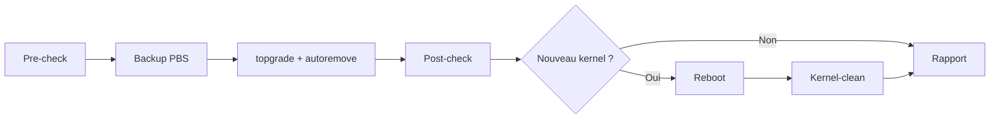

# 🚀 PVE Update Orchestrator

> 🖥️➡️✨ Fini les 4h de MAJ manuelle : **un seul binaire Go** pilote tes 7 nodes Proxmox, LXC, VM & Docker — en toute sécurité, avec rapports Discord et dashboard intégré.


---

## 📖 Sommaire

- [📜 1. Contexte](#-1-contexte--le-problème)
- [🎯 2. Objectif](#-2-objectif--la-promesse)
- [⚖️ 3. Choix technique](#️-3-choix-technique--go--gagnant)
- [🏗️ 4. Architecture](#️-4-architecture--un-seul-binaire)
- [🔌 5. Connexions SSH efficaces](#-5-connexions-ssh-efficaces--le-cœur-du-sujet)
- [🔄 6. Workflow](#-6-workflow--ce-que-fait-le-robot)
- [💾 7. Backup & Rollback](#-7-backup-pbs--rollback--filet-de-sécurité)
- [🔔 8. Discord](#-8-discord-bot-alarm--zéro-silence)
- [🖥️ 9. Dashboard JS](#️-9-interface-web--dashboard-js-intégré)
- [🛡️ 10. Garde-fous](#️-10-garde-fous--jamais-de-force-brutale)
- [🗺️ 11. Roadmap](#️-11-roadmap--4-lots)
- [📎 12. Annexes](#-12-annexes--la-source-de-vérité)

---

## 📜 1. Contexte — le problème

⏰ **~4h chaque semaine** de maintenance manuelle sur un cluster de **7 nodes** :

| 🎯 Cible | 🔁 Cycle manuel actuel |
|---|---|
| 🖥️ **Node Proxmox** | 🩺 logs → 🛠️ correctifs → ⬆️ `topgrade -y` → 🧹 `apt autoremove -y` → 🔁 reboot si nouveau kernel → 🧼 `kernel-clean` |
| 📦 **LXC / VM** | Même cycle via `pct/qm exec` (⚠️ LXC = restart, pas reboot kernel — kernel partagé avec l'hôte) |
| 🐳 **LXC `docker`** | Cycle LXC + `compose pull / up -d` + `prune` + `healthcheck` |

😩 Répétitif, fragile, aucun rapport centralisé, aucun rollback garanti.

---

## 🎯 2. Objectif — la promesse

> Remplacer les scripts bash par un **logiciel compilé, durable et supervisable** 💪

- ✅ **Un seul binaire** `pve-orchestrator` — pas de dépendances à installer
- 🔌 **SSH mutualisé** — fini le `ssh` forké 100× par run
- 🔄 **Cycle imposé** par cible :
  `🩺 pré-check → 💾 backup PBS → ⬆️ update → 🩺 post-check → 🔁 reboot si kernel → 🧼 kernel-clean → 📣 rapport`
- 🔔 **Discord systématique** : `▶️ start + 🧩 1 embed/cible + 🏁 synthèse`
- 🖥️ **Dashboard JS intégré** — pas de 2ᵉ projet à maintenir



---

## ⚖️ 3. Choix technique — Go 🏆 gagnant

| 📊 Critère | 💙 **Go (retenu)** | 🐍 Python |
|---|---|---|
| 📦 Binaire unique | ✅ `go build` ~15 Mo, zéro runtime | ❌ venv + dépendances fragiles |
| 🔌 SSH multiplexé | ✅ natif `x/crypto/ssh` + goroutines | ⚠️ `paramiko` OK mais GIL + lent |
| ⚙️ Service systemd long-running | ✅ excellent | ⚠️ moyen |
| 🚀 Vitesse d'itération | 👍 bonne | 🏆 meilleure |

> 💡 **Décision : Go pour le cœur**, Python uniquement en scripting ponctuel.
> 🎨 Frontend : `HTML + JS vanilla + CSS`, embarqué via `//go:embed` — **zéro build JS** !

🧰 **Stack Go** : `stdlib` + `golang.org/x/crypto/ssh` + `spf13/cobra` + `gopkg.in/yaml.v3` + `modernc.org/sqlite` + `net/http`.

---

## 🏗️ 4. Architecture — un seul binaire

> 📍 S'exécute sur un **LXC dédié `admin`** (ou poste admin). **Jamais** sur les 7 nodes !

```text
📁 pve-orchestrator/
├── 🚀 cmd/root.go             # CLI cobra : run, inventory, health, rollback, bootstrap-ssh, serve
├── 🧠 internal/
│   ├── ⚙️ config/             # config.yaml + /etc/pve-orchestrator/.env (🔒 secrets hors git)
│   ├── 🗺️ inventory/          # seed nodes.yaml + découverte pvecm/qm/pct → SQLite
│   ├── 🔌 sshpool/            # pool SSH persistant (cf. §5) ⭐
│   ├── 🖥️ pve/                # client API PVE + wrappers pct/qm/vzdump
│   ├── 🩺 health/             # pvecm, systemctl --failed, journalctl, dmesg, zfs/ceph, SMART
│   ├── 💾 backup/             # vzdump snapshot + vérif + prune
│   ├── ⬆️ update/             # node.go • guest.go • docker.go • kernelclean.go (natif !)
│   ├── 🔔 discord/            # embeds, retry 3×, split 2000 car.
│   ├── 🏃 runner/             # rolling, parallélisme, resume, verrou, run-id
│   ├── 🗄️ store/              # SQLite : runs, targets, backups, events
│   └── 🌐 server/             # API REST + fichiers statiques (dashboard)
├── 🎨 web/                    # index.html + app.js + style.css (go:embed)
├── 📝 configs/                # config.example.yaml • nodes.yaml • inventory.example.yaml
├── 🔧 systemd/                # .service + .timer (run hebdo 📅 samedi 02:00)
└── 🐳 Dockerfile              # build reproductible (optionnel)
```

♻️ **Fini le bricolage** :

| Avant (bash) | Après (Go natif) |
|---|---|
| `curl \| bash kernel-clean.sh` + `whiptail` ❌ | `kernelclean.go --keep 2`, protection kernel booté ✅ |
| `backup-prune.sh` artisanal | `backup/prune.go` intégré ✅ |
| JSONL à la main | SQLite requêtable ✅ |

---

## 🔌 5. Connexions SSH efficaces — le cœur du sujet ⭐

> 🧠 **Principe d'or : 7 connexions persistantes, pas N×M éphémères !**

### 5.1 🗺️ Topologie d'accès

```text
              ┌─────────────┐
              │ 🤖 LXC admin │
              │ pve-orch.   │
              └──────┬──────┘
         🔌 SSH persistant (×7, ed25519 dédiée)
      ┌──────┬───────┼────────┬────────┐
      ▼      ▼       ▼        ▼        ▼  ...
   🖥️ Janus 🖥️ Zeus 🖥️ Nyx  🖥️ Loki  ...
      │ pct exec / qm guest-exec (pas de SSH direct !)
      ├─ 📦 LXC 100
      ├─ 🖥️ VM 101
      └─ 🐳 LXC docker
```

- 🔌 **SSH uniquement vers les 7 nodes** (`root@<ip>`, clé `pve-orchestrator_ed25519`)
- 📦 **Guests via le node hôte** : `pct exec <vmid> -- <cmd>` / `qm guest-exec` — fini les IPs changeantes, guests éteints, firewalls ! Division des connexions par ~10-20 📉
- 🔀 **Fallback SSH direct** seulement si `direct_ssh: true` dans `inventory.yaml` (VM IP fixe, agent KO)

### 5.2 🏊 Le pool SSH (`internal/sshpool`)

| ⚙️ Paramètre | 📋 Valeur |
|---|---|
| 🔗 Clients | 1 `*ssh.Client` / node, vivant tout le run |
| 💓 Keepalive | 15 s |
| ⏱️ Timeouts | dial 10 s, commande configurable |
| 🔁 Retry | exponentiel 3× + re-dial transparent |
| 🔁 Reboot node | attente active `ssh + pveproxy + pvecm`, deadline 15 min |
| 🔒 Host keys | `accept-new` au bootstrap, vérifié ensuite |
| 🏃 Concurrence | nodes **séquentiels** (rolling, canary d'abord) • guests **parallèles bornés** (worker-pool = 4) sur la même connexion parent |

> 🏎️ **Gain :** ~50-100 commandes/cible **sans** re-handshake TCP+SSH à chaque fois !

### 5.3 🔑 Bootstrap & hygiène des clés

```bash
# 🌱 Une seule fois — la seed ne sert QUE pour ça :
pve-orchestrator bootstrap-ssh --seed-key ~/.ssh/flamachere_pro_20260511
# → génère pve-orchestrator_ed25519
# → ssh-copy-id vers les 7 nodes + ssh-keyscan → known_hosts
# → test hostname + pvecm status + journal des empreintes 📝
```

- 🙈 La seed **ne sert plus jamais** en run courant
- 🔄 Rotation : `bootstrap-ssh --rotate` (annuelle) • révocation : `bootstrap-ssh --revoke`
- 🚫 Clé privée **jamais en git** (`.gitignore` + `gitleaks`)

### 5.4 🌐 Bonus PVE API

Si token API dispo → lectures inventaire/statut en **HTTPS API** (moins de SSH), exécutions toujours en SSH/`pct exec` (plus fiable que l'agent seul).

> ✅ **Décision actée : SSH-only.** Pas de token API avant la v1.0 au plus tôt (zéro secret supplémentaire, parsing `pvecm/qm/pct` suffisant et testé). Réévaluer en Lot 2 si besoin.

---

## 🔄 6. Workflow — ce que fait le robot 🤖

```bash
# 🗺️ Synchroniser l'inventaire réel
pve-orchestrator inventory sync --nodes Janus,Zeus,Nyx,Loki,Aphrodite,Atlas,Artemis

# 🔍 Audit sans toucher (toujours commencer par là !)
pve-orchestrator run --all --dry-run

# 🐤 Canary : Janus d'abord, puis pause
pve-orchestrator run --nodes Janus --canary-first

# 🎯 Ciblage fin
pve-orchestrator run --vmids 100,101 --only os
pve-orchestrator run --tags docker --only docker

# ⏯️ Reprise après reboot node (idempotent !)
pve-orchestrator run --resume --run-id 20260919-0200

# ↩️ Rollback
pve-orchestrator rollback --run-id 20260919-0200 --vmid 100

# 🖥️ Dashboard + API
pve-orchestrator serve --listen :8080
```

📋 **Ordre imposé** : `🗳️ quorum → 🖥️ nodes 1 par 1 → 📦 guests (LXC puis VM) → 🐳 docker → 🧹 prune + 🏁 synthèse`
🔒 **Verrou** : lock fichier + ligne `runs` SQLite (`run-id=YYYYMMDD-HHMM`).

<details>
<summary>🖥️ <b>Par Node</b> — cliquez pour déplier</summary>

1. 🩺 **Pré-check** : `pvecm status` 🗳️, `pveversion`, `systemctl --failed`, `journalctl -p err --since 7d`, `dmesg -l err`, `zfs/ceph/pvesm` → ❌ critique = `hold` + embed, on passe au suivant
2. 🚚 **Évacuation** : HA + `migrate --online` si reboot probable
3. ⬆️ **Update** : `topgrade -y --only system`, `apt autoremove -y`, `apt clean`
4. 🐧 **Kernel** : diff `uname -r` + `dpkg -l pve-kernel` → 🔁 reboot si `--auto-reboot` + quorum OK
5. 🧼 **Kernel-clean natif** post-reboot (`keep=2`, jamais le booté, + `proxmox-boot-tool refresh`)
6. 🩺 **Post-check** + diff before/after 📊

</details>

<details>
<summary>📦 <b>Par LXC / VM</b> — cliquez pour déplier</summary>

1. 🩺 Pré-check (`pct/qm status`, `systemctl --failed` via exec, agent QEMU 👻)
2. 💾 **Backup PBS snapshot obligatoire** — sinon ⛔ fail-closed, pas d'update !
3. ⬆️ `topgrade -y` + `autoremove` via exec
4. 🔁 Reboot si kernel (VM ; LXC = restart documenté 📝)
5. 🧼 VM : `apt autoremove --purge` (keep 2) • LXC : rien (hérite hôte, loggé)
6. ↩️ Post-check KO → hint rollback 🔔

</details>

<details>
<summary>🐳 <b>Couche Docker</b> — cliquez pour déplier</summary>

1. 📋 `docker ps/images`, `compose ls`
2. ⬆️ `compose pull && up -d` (ou `run` équivalent inventorié)
3. 🧹 `system prune -f` (`image prune -a` seulement avec `--prune-all` ⚠️)
4. 💚 Healthcheck : `health=unhealthy`, `curl -f` endpoints, `logs --tail 50` en erreur

</details>

---

## 💾 7. Backup PBS + Rollback — filet de sécurité 🪢

| ✅ Règle | 📝 Détail |
|---|---|
| 📸 Snapshot | **Toujours**, jamais stop : `vzdump --mode snapshot --storage pbs-pre-update --compress zstd` |
| 🔍 Vérification | Snapshot listé + taille > 0 + log OK, enregistré en base `{run_id, vmid, node, snapshot, size}` |
| 🧹 Rétention | Prune auto post-run OK (`--daily 7 --weekly 4`) |
| ↩️ Rollback guest | `stop + pct restore / qmrestore + start + post-check + embed` 🔔 |

> ⚠️ **Limite assumée nodes** : pas de snapshot possible → rollback = journal apt + `proxmox-boot-tool kernel pin <prev>` + restore `/etc` (etckeeper).

---

## 🔔 8. Discord bot-alarm — zéro silence 🤫➡️📣

> 🔒 `DISCORD_WEBHOOK_UPDATEUR` **uniquement** dans `/etc/pve-orchestrator/.env` (mode 600).
> ✅ **Décision actée : pas de rotation.** Le webhook historique est verrouillé en écriture sur un seul canal privé ultra-restreint, sans droits admin. Risque résiduel assumé et documenté : quiconque détient l'URL peut poster sur `bot-alarm` — à réévaluer si le dépôt devient public ou si l'audience change.

| 💬 Message | 🎨 Contenu |
|---|---|
| ▶️ **Start** | run-id, scope, dry-run ?, fenêtre reboot, lien runbook |
| 🧩 **1 embed / cible** | `🟢 node OK (12→18 pkgs, kernel …→…, reboot 3m12)` ou `🔴 vm/100 FAIL (nginx failed, rollback: snap-xyz)` + pré-check, backup ID, durée, `tail -20` |
| 🏁 **Synthèse** | tableau OK/WARN/FAIL/SKIPPED, durée totale, espace libéré 🧹, actions humaines 🙋, commande rollback exacte |

🔁 Retry 3× • ✂️ split >2000 car. • 📢 `@here` **seulement** si quorum/HA impacté • 🧵 threads par `run-id`.

---

## 🖥️ 9. Interface web — dashboard JS intégré 🎨

> Servi par `pve-orchestrator serve` (derrière Zoraxy + VPN/Tailscale + basic-auth 🔒). **Jamais de SSH depuis le navigateur !**

| 👀 Vue | 📝 Contenu |
|---|---|
| 🗺️ Carte cluster | 7 nodes : pastille quorum 🗳️, kernel 🐧, pending-reboot 🔁, espace 💽 |
| ⏳ Timeline run | `pré-check → backup → update → reboot → kernel-clean → post-check` par cible |
| 🔍 Fiche cible | delta paquets 📊, snapshot ID + bouton rollback (double confirmation ⚠️), logs tail |
| 🧱 Mur Discord | embeds déjà envoyés |
| 🙋 File humaine | holds, SKIP, erreurs logs à corriger main |

🔌 **API** :
`GET /api/inventory` • `GET /api/runs?limit=20` • `GET /api/runs/<id>` • `GET /api/events?run=<id>` • `POST /api/actions {rollback|retry|dry-run}`

- 🌱 Phase 1 : lecture seule
- 🔓 Phase 2 : actions (token + allowlist + audit + miroir Discord)

---

## 🛡️ 10. Garde-fous — jamais de force brutale 🚫💪

⛔ `SKIP + WARN/FAIL` (jamais de force sauf `--force --reason "..."` tracé 📝) si :

🗳️ quorum perdu • 🪸 Ceph `HEALTH_ERR` • 🏷️ HA en erreur • 💾 backup KO • 🕑 fenêtre reboot dépassée • ❌ `topgrade` exit ≠ 0 • 💽 `/ < 20%` • 🔌 PBS inaccessible

🧪 Qualité : `go vet + golangci-lint + go test` (pool SSH mock, dry-run, rollback sur VM poubelle 🗑️).

---

## 🗺️ 11. Roadmap — 4 lots 📦

| 📦 Lot | ⏱️ Durée | 🎯 Contenu | ✅ Validation |
|---|---|---|---|
| 🌱 **Lot 0 — Socle** | 1 sem | Squelette Go + config + `bootstrap-ssh` + `inventory sync` 7 nodes + CI | `build/vet/test` verts |
| 🚀 **Lot 1 — MVP** | 1-2 sem | `runner + health + update` + Discord + `serve` lecture seule | Canary Janus + 1 guest `--dry-run` puis réel |
| 💪 **Lot 2 — Durcissement** | 1-2 sem | Rolling + reboot/resume, kernel-clean natif, rollback testé, timer systemd | Rollback réel sur VM poubelle 🗑️ |
| 🎨 **Lot 3 — Docker + UI** | 1 sem | Module docker + healthchecks, boutons `retry/rollback`, runbook | Revue d'un run Discord complet |

> 🏆 **Objectif : 4h manuelles → ~30 min de supervision ☕**

---

## 📎 12. Annexes — la source de vérité 📚

### 🌍 12.1 Cluster → `configs/nodes.yaml`

| 🖥️ Host | 🌐 IP | 🐤 Rôle |
|---|---|---|
| 🐤 **Janus** | `192.168.110.110` | Canary (pilote) |
| ⚡ Zeus | `192.168.110.106` | Standard |
| 🌙 Nyx | `192.168.110.108` | Standard |
| 🔥 Loki | `192.168.110.109` | Standard |
| 💖 Aphrodite | `192.168.110.112` | Standard |
| 🌍 Atlas | `192.168.110.191` | Standard |
| 🏹 Artemis | `192.168.110.192` | Standard |

### 🔑 12.2 Clé seed bootstrap

🔌 Connexion initiale en root via `~/.ssh/flamachere_pro_20260511` **uniquement** pour `bootstrap-ssh`. Ensuite → clé dédiée `pve-orchestrator_ed25519` 🔒.

### 🔔 12.3 Webhook Discord

> ✅ Rotation refusée (voir §8 : canal privé verrouillé, risque assumé). Webhook à placer dans `/etc/pve-orchestrator/.env`. **Aucune URL en clair ici** 🙈.

### 🌐 12.4 Dépôts distants — Gitea (principal) + GitHub (miroir)

| 🏷️ Remote | 🔗 URL | 🎯 Rôle |
|---|---|---|
| `origin` | `ssh://gitea@gitea.smiden.eu:2222/flamachere/PVE_Update_Orchestrator.git` | 🥇 Principal (Gitea) |
| `github` | `git@github.com:lamacheref/PVE_Update_Orchestrator.git` | 🪞 Miroir backup (GitHub) |

🔄 **Synchronisation manuelle** (les deux distants restent identiques) :

```bash
git push origin main
git push github main --tags
```

🤖 **Synchro auto en un push** (option recommandée) :

```bash
# Le remote "all" pousse vers les 2 distants d'un coup
git remote add all ssh://gitea@gitea.smiden.eu:2222/flamachere/PVE_Update_Orchestrator.git
git remote set-url --add --push all ssh://gitea@gitea.smiden.eu:2222/flamachere/PVE_Update_Orchestrator.git
git remote set-url --add --push all git@github.com:lamacheref/PVE_Update_Orchestrator.git

git push all main --tags   # pousse Gitea + GitHub en une commande
```

---

<div align="center">

**🚀 PVE Update Orchestrator — 🤖 moins de maintenance, ☕ plus de café.**

*Go • Proxmox • SSH multiplexé • Discord • Dashboard JS*

</div>
